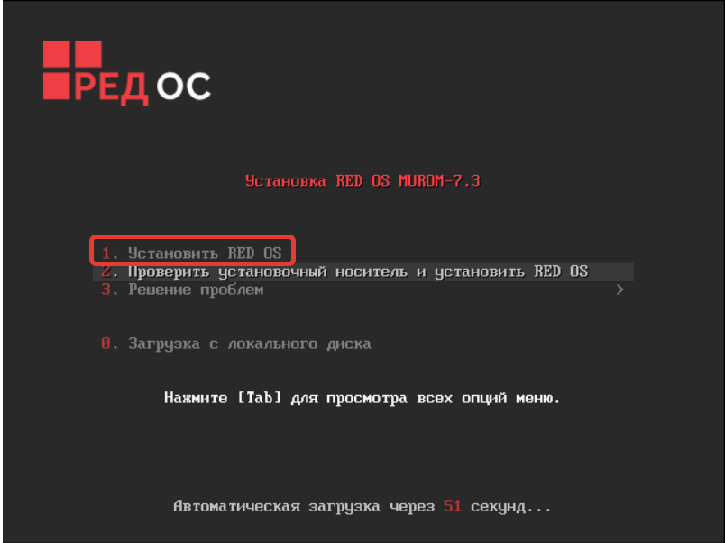
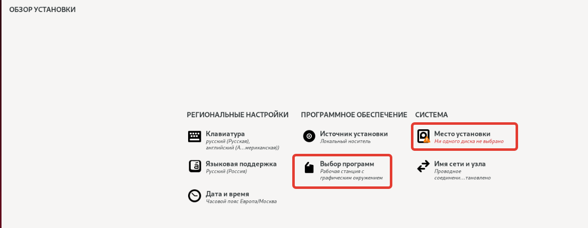
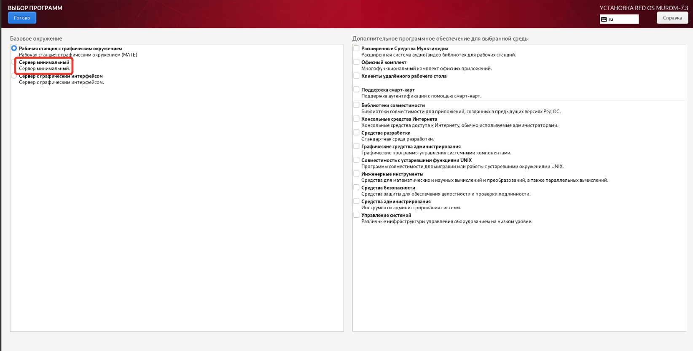

# Установка ОС Red OS 7.2

##### Скачать образ можно здесь:
https://redos.red-soft.ru/product/downloads/

- Зайти в `Выбор программ` и выбрать там `Сервер минимальный`

- Зайти в `Место установки` и выбрать там на какой диск устанавливать ОС

- Нажать `Далее`

- Установить пароль пользователю root и создать юзера admin 
с правами суперпользователя

- Дождаться конца инсталляции и нажать кнопку перезагрузить