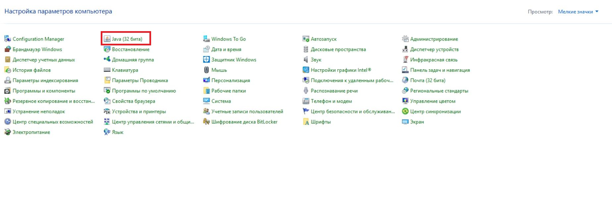
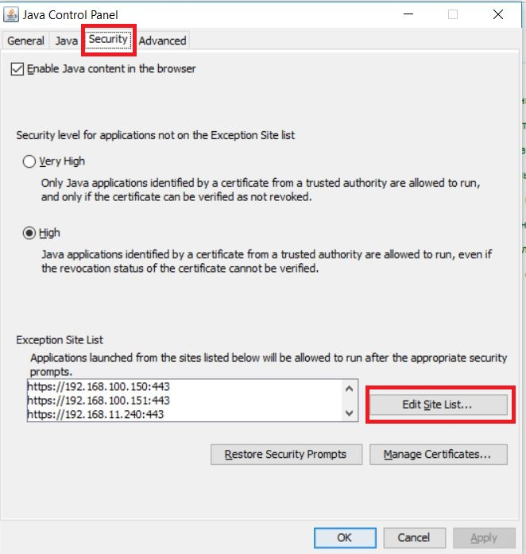
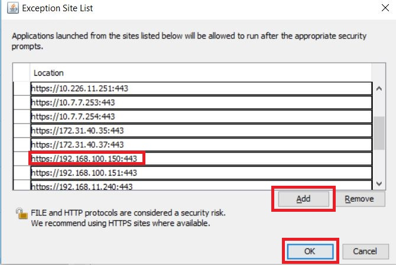
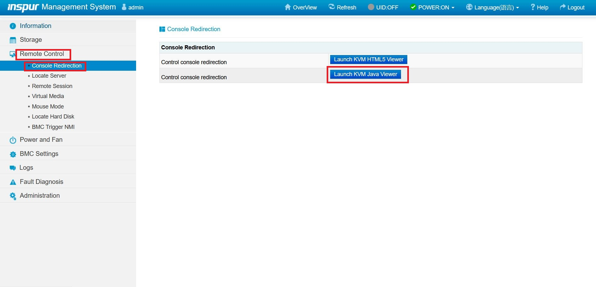
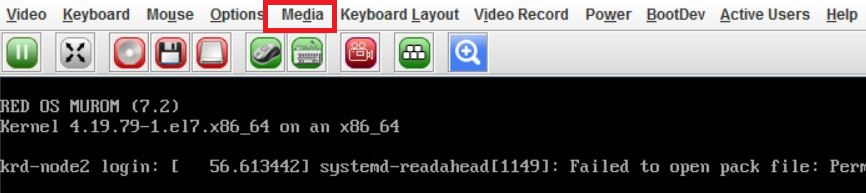
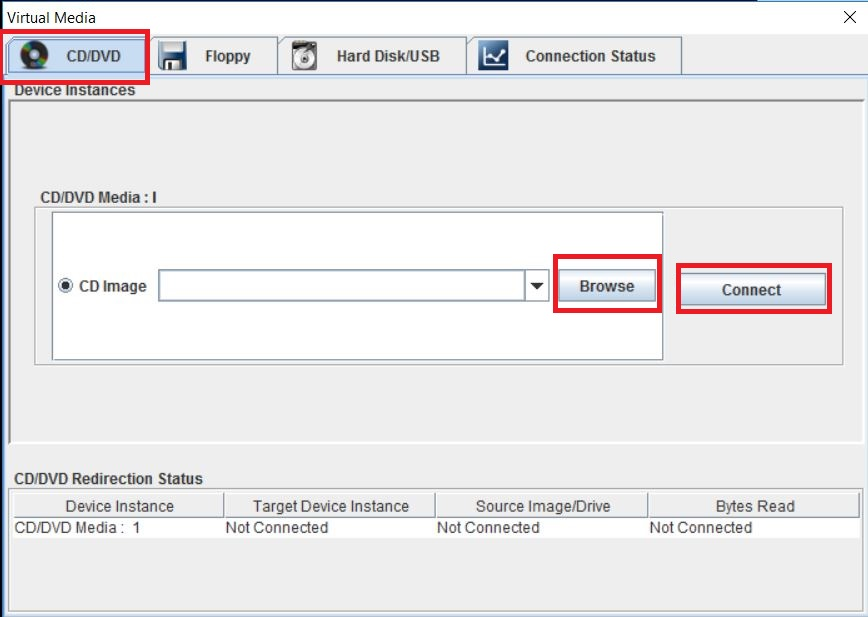

# IPMI

- Открыть панель управления и зайти в `java`



- Зайти в вкладку `security` и выбрать `edit site list`



- Нажать кнопку `Add`  добавить IPMI адрес 
```
https://192.168.1.1:443
```



- Перейти в вебинтерфейс IPMI





- Выбрать образ и нажать `connect`




***

##### Далее можно приступить к инсталляции ОС